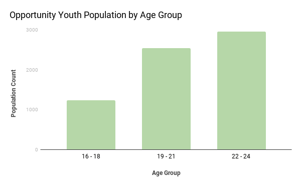
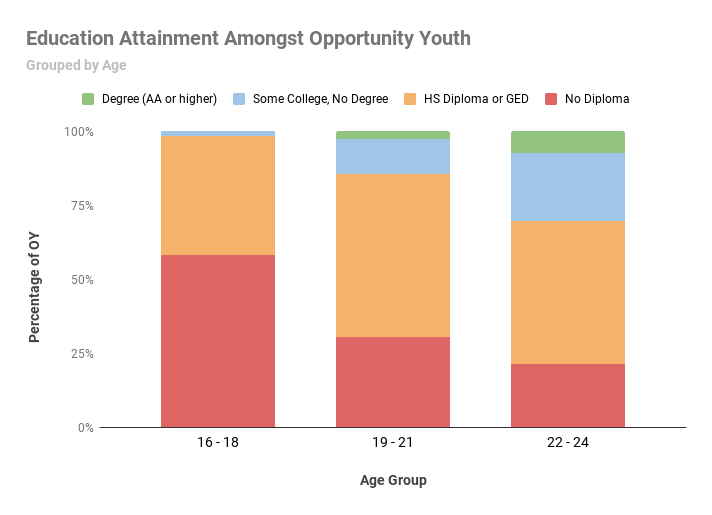
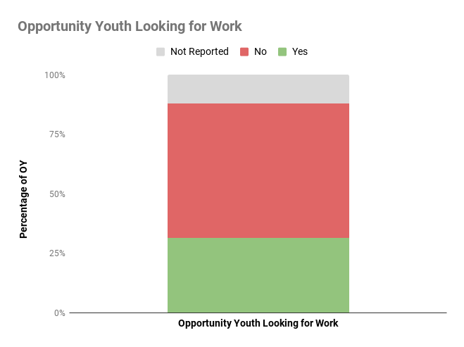

# Analysis Part 2:

In Part 2 of this analysis, we find an updated estimate on the number of Opportunity Youth in South King County.

We will then dive deeper into this population by breaking down the number of Opportunity Youth by puma code, age groups, educational attainment and employment availability. 

### 1. Updated Population Estimate of OY:
Using the person weights from the 2017 pums data, we found an updated estimate of the Opportunity Youth in South King County to be 6723.

### 2. OY Population by PUMA:
We can see the breakdown of the OY population by PUMA codes, as per our definition of South King County from Part 1:

- PUMA 11612 - King County (Far Southwest): 1977 - 29%

- PUMA 11613 - King County (Southwest Central): 2006 - 30%

- PUMA 11614 - King County (Southwest): 1530 - 23%

- PUMA 11615 - King County (Southeast): 1210 - 18%

This distribution of the OY population might lead to further investigations about why the Southwest regions of King County account for 82% of the OY population in South King County.  What are the differentiating factors between Southwest and Southeast King County?  

### 3. OY Population by Age Group:
We decided to break the OY population into three age groups: 16-18yo, 19-21yo, 22-24yo.  This was so we could make comparisons with the 2016 report as well as being able to capture the potentially unique circumstances of each group.  

From this bar graph, we can see that the population of OY is highest for the 22-24 year olds and lowest for the 16-18 year olds.  This might be a trend we expect to see, since 16-18 years are more likely to still be under the supervison of family members and/or adults and so have more accountability to be in school or working.  

Further investigation into the living situations of OY 19 and older might shed light on the factors contributing to their school enrollment and employment status.  

### 4. Education Attainment Amongst Opportunity Youth:
Since education is one of the definig factors of OY, it seems necessary to investigate the levels of education this population has attained, given that they are not currently in school.  

Across all ages, 49% of Opportunity Youth had a high school diploma or a GED.  We can see from the figure above that, when broken down by age group, we can see that 55% of 19-21yo and 48% of 22-24yo have achieved a high school diploma or GED whereas 58% of the 16-18yo have not attained a diploma.  This is not too surprising given that people between 16-18 years old are 'school aged', so it is typical to see 16-18yo without a diploma.  Further investigation into these circumstances is necessary.  

### 5. Opportunity Youth Looking for Work:
As employment is the second defining factor of Opportunity Youth, it is compelling to look into the motivations Opportunity Youth have toward seeking employment.  

While 12% of the data was not reported, 56.7% of Opportunity Youth reported 'No' in the survey, in response to the category 'Looking for Work' (80% of which came from ages 19-24).  This sparks the question "why are Opportunity Youths not looking for work if they are neither in school or working?".  

## Summary
Our analysis so far has highlighted the need for further investigation into the education and employment status' of the Opportunity Youth.  

Variables such as motivation for seeking education or employment, living circumstances and accountability systems for each age group require further research to gain a deeper understanding of the characteristics defining Opportunity Youth.